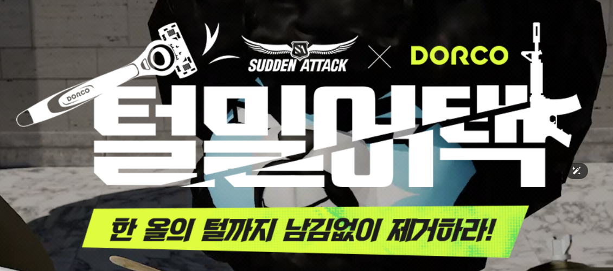

# 📙이벤트 분석

## 서든어택

### 털밀어택(서든어택 X DORCO 콜라보)

🙎🏻‍♂️이게 무슨 이벤트인가요? 

도루코 면도기와의 콜라보로 서든어택 X 도루코의 리미티드 에디션으로 제품과 패키지 구성품을 판매와 동시에 인게임내 이벤트 진행

🙎🏻‍♂️핵심포인트 1

인게임내에서 퀘스트를 달성할시에 이벤트 코인을 증정하며, 이 이벤트 코인으로 도루코와 관련된 인게임내 아이템을 지급 및 응모권과 게임내 경험치를 증정해주어서, 굳이 도루코 면도기가 필요없는 유저층에게도 홍보 효과를 주고 있음.

🙎🏻‍♂️핵심포인트 2

유정석이라는 남자 유저들의 심금을 울릴만한 캐스팅을 통해서, 이벤트 전용 음원을 뽑아냈으며, 영상을 홍보하였음.

🙆🏻‍♂️ 면도를 하는 유저들에게 친숙한 도루코라는 브랜드와 서든어택의 콜라보가 굉장히 신선하게 작용.

면도기의 칼날과 서든어택 인게임내에서 사용되는 근접무기와 연관시켜서 콜라보하여 인게임내의 아이템에서 도루코 제품을 제공하여 간접적으로 체험하고 소비의 거리를 가까이해서, 소비로까지 이어지게 할 수 있다는 점이 포인트.

메이플스토리의 네네치킨 콜라보, GS25, BTS 콜라보와 같이 넥슨의 타 브랜드를 활용한 마케팅이 유저들로 하여금 신선한 포인트로 작용하여 게임을 플레이하는데에 활기를 더하는 요소로 작용하는듯 하다. (개인적인 경험담)

도루코 콜라보 이벤트의 아쉬운점은 아무래도 유저들은 해당 브랜드와 콜라보한 제품을 기념 or 소장용으로 갖고자 주문했는데 그에 맞지않은 재고량으로 주문이 조기마감되어서, 많은 유저층이 구입할 수 없게 만든점이 아쉽다.

해당 이벤트를 통해서, 유저당 1회 랜덤 뽑기를 하여 도루코 제품에 대한 몇 퍼센트 할인권을 증정해주면 콜라보한 도루코 제품뿐만 아니라, 도루코 브랜드의 기존 제품까지 구매로 이어질 수 있지 않을까 싶다.

## THE FINALS(더 파이널스)

### 최애 스폰서 팬아트 대회

🙎🏻‍♂️이게 무슨 이벤트인가요? 

더 파이널스 시즌4에서 특정 스폰서와 계약을 하고 플레이 할 시에, 보상들을 얻을 수가 있는데 해당 스폰서의 팬아트를 그리는 이벤트(이 스폰서라는 시스템은 2024-10-23 더 파이널스에 들어가서 경험해볼 예정)

🙎🏻‍♂️핵심포인트 1

시즌4 컨텐츠의 핵심 기능중 스폰서라는 기능을 홍보함과 동시에 유저들이 직접그린 팬아트를 응모함으로써, 창작물로 유저들의 참여를 유도시키고, 디스코드 채널내에서 작품물을 투표하는 시스템을 마련해, 팬아트를 그리지 않은 유저들도 참여하여 보상을 받아갈 수 있게 하여 모든 유저들이 이용할 수 있는 이벤트를 만듦.

🙎🏻‍♂️핵심포인트 2

게임사에서는 팬아트를 어떤식으로 유저층이 창출해냈는가와 유저들의 반응들을 확인할 수 있어서 이를 데이터로 사용이 가능하다.

---